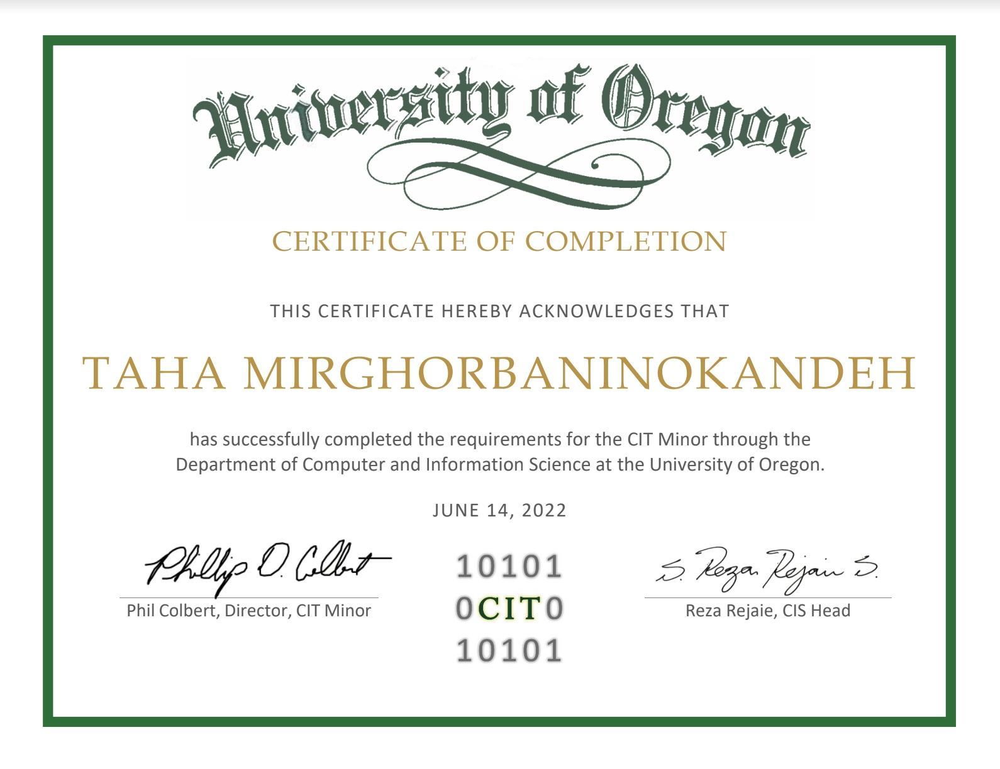

# Data Scientist
#### Technical Skills: R, Python, JavaScript

## Education
- M.S., Applied Statistics              | Loyola University Chicago (_Dec 24'_)

- B.S., Operations & Business Analytics | University of Oregon (_March 23'_)

 
### Current Role: Statistical Researcher at College of Math and Statistics 
**_Fully funded graduate researcher**
 -  Utilized Excel, R, and SAS to learn about logistic models, permutation tests, and simulations like such as Monte Carlo.
 -  Conducted research on socio-demographic data from Chicago and created data art using data visualization techniques.
 -  Developed research models and completed pose estimation projects using Python programming language.

  

## Computer Info Tech minor:
 - Covered key topics for six-courses such as information technology, web programming, web applications development, database systems, and networking fundamentals. Proficient in XHTML, CSS, JavaScript, XML, PHP, MySQL, data modeling, and network security principles.
 - Designed and developed a sentimentally aware online shopping website using large language models to analyze customer reviews and feedback. Implemented sentiment analysis algorithms to improve user experience and increase sales conversion rates through personalized product recommendations and targeted marketing strategies.

## _Projects:_

<iframe src="https://docs.google.com/presentation/d/e/2PACX-1vTJCn8IEkMuPrK-yjtetQp4YV__HZoJP7RqufHGN9P_KgZ5hpXSSc-wUXKbeUIXiYXrR9ASGMic_65g/embed?start=true&loop=false&delayms=5000" frameborder="0" width="480" height="299" allowfullscreen="true" mozallowfullscreen="true" webkitallowfullscreen="true"></iframe>

## Work Experience:

**Intern @ Office of the Senior Vice President for Finance and Administration - University of Oregon**
 - Designed data pipelines to display real time KPI's on dashboards that reduced operational costs by 1/3 (Campus Planning and Facility Management Office)
 - Revolutionized the screening process for University Owned artwork by revamping the [geolocation](https://map.uoregon.edu/) system in collboration with the GIS office. (Safety and Risk Management Office)

## Data Services Division - University of Oregon Libraries
**_Quantitative Research Methods Consultant_**  
*Dec 2020 – Dec. 2022*   
 - Provided statistical consultations to the U of O’s research faculty and students on using R, Python, Excel, Tableau, SPSS, etc. to create descriptive statistics, perform and interpret statistical tests, develop data visualizations, and create statistical models.
 - Reinvented the Search Engine Optimization for the [blog](https://dataservices.uoregon.edu/author/taham/) and tripled the follower retention for Twitter and Instagram accounts.
 - Led the following Workshops:
   * Programming with Python
   * Data Analysis and Visualization in Python
   * Programming with R

## Renovatio (NGO)
**Business Consultation Intern** (Remote)  
*Sept 2020 – Dec. 2020*  
 - Worked remotely alongside a team of honors students as business consultants for a Brazilian eyecare NGO to devise solutions for their challenges generating international funding.
 - Analyzed financial records to determine appropriate capital allocation for proposed solutions according to increases in income.
 - Presented strategies and ideas through weekly briefing memoranda and meetings with senior management. The internship concluded with a final proposal presentation, which received very positive feedback from our client.

## University of Oregon Student Government (ASUO-Legislative Branch)
**Departments Finance Committee, Legislative Branch, Seat 03**  
*Jan. 2021 – May 2021*  
 - Worked within a group of financial legislators to make budget recommendations under the committee’s jurisdiction.
 - Attended committee meetings, hearings, and officer training; held weekly office hours; communicated with committee members and acted as a communication liaison within ASUO (Associated Students of the University of Oregon).

## Student Cooperative Association
**Treasurer / Conflict Resolution Team**  
*Jan. 2021 – Present*  
 - Attended training on funds management and oversaw the Lorax Manor Student housing budget.
 - Received training on conflict resolution and served as the liaison.

## Sustainable Cities Institute
**Research Assistant** (Remote)  
*Feb. 2022 – April 2022*  
 - Utilized Qualtrics© APIs and React.Js to design an online evaluation tool for the “Shared Mobility Equity Research” project funded by the National Institution of Transportation Communities (NITC) that provides feedback to transportation agencies.
 - Studied the research project’s findings in the original evaluation tool hosted on Qualtrics.

## GENSCO Inc. Seattle
**Operations Management Intern** (Full-time)  
*June 2022 – Sep. 2022*  
 - Shadowed corporate employees in Information Technology, Supply chain Operations to learn about facility management services.
 - Worked on a final project that involved gathering data, analyzing, and implementing to improve safety protocols at HVAC storage plant.

## Research Lab of Head of Finance Department, Professor John Chalmers
**Equity Research Analyst**  
*Nov. 2022 – March 2023*  
 - Conducted statistical analysis using High-Performance computing to optimize algorithms in R programming language and held weekly meetings with Professors and Ph.D mentors.
 - Bolstered the Nielsen demographic data with WARN data scraped from each of 52 states’ websites using Python and Excel.

## Operations and Business Analytics Club (OBAC)
**President-elect**  
*Sep. 2021 – March 2023*  
 - Made executive decisions, managed outreach to alumni, and hosted talks by industry professionals.
 - Brainstormed with club fund management and pitched ideas to best serve the student members professionally.
 - Taught Python and SQL programming as part of the [club](https://obac.uoregon.edu/) agenda to bolster the technical skills for the members.

## Tetris!

<iframe src="https://codesandbox.io/embed/r34h6h?view=preview&module=%2Fsrc%2Findex.js"
     style="width: 85%; height: 870px; border: 0; border-radius: 4px; overflow: hidden;"
     title="Tetris Game"
     allow="accelerometer; ambient-light-sensor; camera; encrypted-media; geolocation; gyroscope; hid; microphone; midi; payment; usb; vr; xr-spatial-tracking"
     sandbox="allow-forms allow-modals allow-popups allow-presentation allow-same-origin allow-scripts"
   ></iframe>
_tetris has stress-reduction effects [source](https://www.ncbi.nlm.nih.gov/pmc/articles/PMC7828932/)_

  <a href="#top" style="padding: 8px; background-color: #007bff; color: white; border-radius: 5px; text-decoration: none;">Jump to Top</a>

