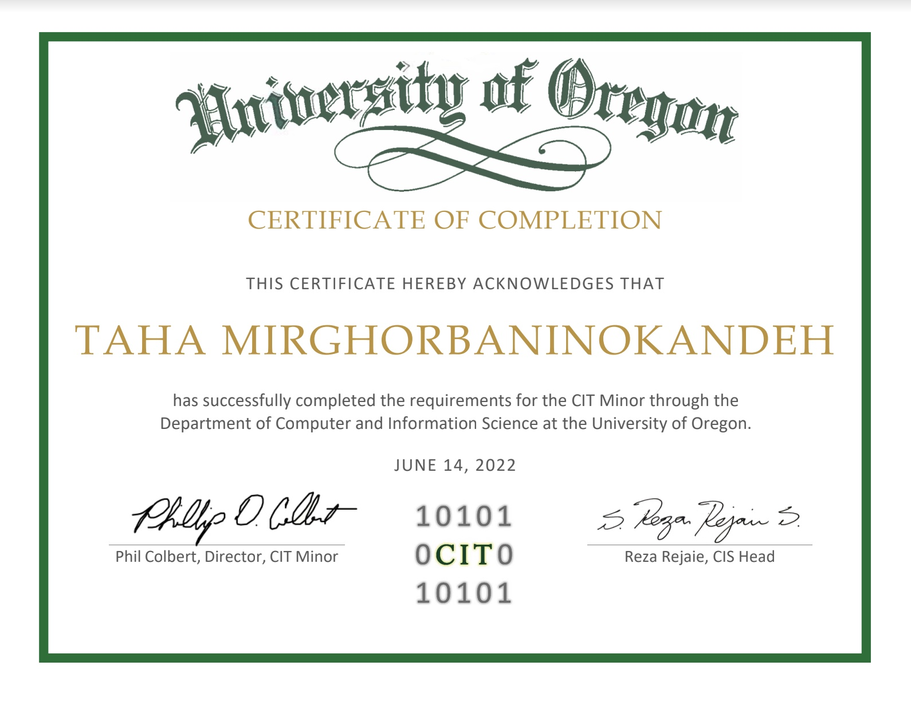

# Taha Mir

### Applied Statistics · Operations Analytics · Data Products · Decision Systems

I build analytical systems that turn complex information into clear, usable decisions.

**Chicago, Illinois** · **M.S. Applied Statistics** · **Founder of Value Signal**

---

## About

I work at the intersection of **operations, data science, financial analysis, and information systems**. My background combines applied statistics, business analytics, software development, research design, and operational problem-solving.

I currently contribute to decision-support and risk-management systems at [DamLogics](https://damlogics.com). I also founded [Value Signal](https://value-signal.vercel.app), a financial research platform that connects quantitative analysis with evidence from SEC filings.

My graduate research focused on accessibility and human-computer interaction, including the development of a webcam-based gaze keyboard for hands-free typing.

### Technical toolkit

---

## Featured Work

<table>
<tr>
<td width="33%" valign="top">

### Value Signal

**Founder · Financial Analytics Product**

A financial research platform that combines valuation scoring, SEC 10-K and 10-Q retrieval, hybrid search, and local Llama-based retrieval-augmented generation.

**Highlights**

- Quantitative screening and valuation workflows
- Evidence-grounded answers linked to SEC filings
- Explainable market signals, risks, and catalysts
- Repeatable company and portfolio research

**Technology:** Financial modeling, RAG, SEC filings, Next.js, local LLMs

[**Launch Value Signal ↗**](https://value-signal.vercel.app)

</td>
<td width="33%" valign="top">

### Virtual Gaze-Driven Keyboard

**Published Accessibility Research**

A hands-free virtual keyboard that uses a standard webcam, MediaPipe FaceMesh, iris tracking, and Eye Aspect Ratio blink detection to support gaze-based typing.

**Highlights**

- Real-time gaze and blink interaction
- Calibration and keyboard-boundary logic
- Dwell heatmaps for performance analysis
- Accessibility-centered HCI design

**Technology:** React, Next.js, MediaPipe, computer vision, HCI

[**Read the paper ↗**](https://doi.org/10.6084/m9.figshare.31883932)

</td>
<td width="33%" valign="top">

### DamLogics

**Infrastructure Risk and Decision Support**

Data and software workflows that help transform inspection evidence into structured, traceable, and decision-ready dam-safety documentation.

**Highlights**

- Structured forms and validation rules
- Audit-ready records and traceability
- ETL and analytics features
- Dynamic summaries and risk charts

**Technology:** Next.js, ETL, data validation, risk analytics, RAG

[**Visit DamLogics ↗**](https://damlogics.com)

</td>
</tr>
</table>

---

## Research

### Virtual Gaze-Driven Keyboard

**In collaboration with Dr. George K. Thiruvathukal**

[Read the full paper](https://doi.org/10.6084/m9.figshare.31883932)

I designed and implemented a hands-free, webcam-based virtual keyboard that enables text input through eye movement and blinks. The system uses MediaPipe FaceMesh and Eye Aspect Ratio detection, with real-time iris tracking, calibration controls, keyboard-boundary logic, predictive text, and dwell heatmaps.

The project explores how browser-based computer vision can produce low-cost accessibility tools without specialized eye-tracking hardware.

### Graduate Research Assistant · Loyola University Chicago

**August 2023 – December 2024**

- Applied Excel, R, SAS, and Python to regression, classification, permutation testing, Monte Carlo simulation, and machine-learning workflows.
- Conducted research using Chicago socio-demographic data and created data art through advanced visualization techniques.
- Developed pose-estimation and human-computer interaction prototypes using Python and modern browser technologies.

### Additional research projects

| Project | Focus |
|---|---|
| **Wine Quality Prediction Using Machine Learning** | Predicted wine quality using physicochemical production attributes and compared model performance. |
| **Boston Housing Valuation Using Machine Learning** | Estimated real-estate values from neighborhood and market-level variables. |
| **Healthcare Supply Chain Optimization** | Modeled resource allocation, inventory constraints, and distribution decisions. |
| **Pinal County Court Process Analytics** | Used network analysis and interactive visualization to study workflows and resource allocation. |

---

## Professional Experience

### Associate Data Consultant · [DamLogics](https://damlogics.com)
**August 2025 – Present**

- Built structured documentation workflows with form inputs, validation rules, and audit-ready records for infrastructure reviews.
- Implemented ETL and analytics features that convert inspection data into dynamic summaries, risk charts, and decision-support outputs.
- Improved platform reliability by diagnosing bugs, refining interface and database flows, and strengthening reporting workflows.

### Operations Management Consultant · Pinal County Court
**August 2024 – December 2024**

- Developed Python network-analysis models to evaluate resource allocation, workflow patterns, and operational equity across court processes.
- Designed interactive visualizations and weekly memoranda that translated case-management data into recommendations for operations managers.

### Equity Research Analyst · Lundquist College of Business
**November 2022 – March 2023**

- Conducted financial and statistical analysis using R, Python, Excel, and high-performance computing.
- Built a national WARN Act dataset by collecting and integrating information from 52 state websites.
- Worked with the Head of the Finance Department and doctoral researchers on empirical finance research.

### Operations Management Intern · GENSCO Inc.
**June 2022 – September 2022**

- Studied information technology, supply-chain operations, warehouse processes, facility management, and customer service.
- Gathered and analyzed operational information to develop a final proposal improving safety protocols at an HVAC storage facility.

### Finance and Administration Intern · University of Oregon
**September 2021 – June 2022**

- Designed KPI pipelines and documentation for Utility and Energy Management within Campus Planning and Facility Management.
- Digitized institutional artwork records through the university’s [interactive geolocation system](https://map.uoregon.edu/) in collaboration with GIS and Risk Management teams.
- Supported template development and operational documentation for Print Services and Communications.

### Quantitative Research Methods Consultant · University of Oregon Data Services
**December 2020 – December 2022**

- Consulted with faculty and students on R, Python, Excel, Tableau, SPSS, descriptive statistics, statistical testing, visualization, and modeling.
- Led workshops in Python programming, Python data analysis and visualization, and R programming.
- Improved the [Data Services blog](https://dataservices.uoregon.edu/author/taham/) and helped increase social-media engagement.

<strong>Additional research, consulting, leadership, and service experience</strong>

 

### Research Assistant · Sustainable Cities Institute
**February 2022 – April 2022**

- Used Qualtrics APIs and React.js to build an evaluation tool for the NITC-funded Shared Mobility Equity Research project.
- Translated research findings into a usable feedback workflow for transportation agencies.

### Business Consulting Intern · Renovatio
**September 2020 – December 2020**

- Worked with an honors-student consulting team supporting a Brazilian eye-care nonprofit.
- Analyzed financial records and evaluated capital allocation for proposed funding strategies.
- Presented weekly briefing memoranda and a final proposal to senior management.

### President-Elect · Operations and Business Analytics Club
**September 2021 – March 2023**

- Made executive decisions, managed alumni outreach, and hosted talks by industry professionals.
- Helped shape club programming and funding priorities.
- Taught Python and SQL through the [club’s professional-development agenda](https://obac.uoregon.edu/).

### Departments Finance Committee · University of Oregon Student Government
**January 2021 – May 2021**

- Worked with student financial legislators to make budget recommendations.
- Participated in hearings, officer training, office hours, and committee communications.

### Treasurer and Conflict Resolution Team · Student Cooperative Association
**January 2021 – Present**

- Oversaw the Lorax Manor student-housing budget.
- Completed conflict-resolution training and served as a community liaison.

---

## Education

### Loyola University Chicago
**Master of Science in Applied Statistics · December 2024**

Graduate research in applied statistics, machine learning, data visualization, generative AI, simulation, experimental design, and human-computer interaction.

### University of Oregon
**Bachelor of Science in Business Administration · March 2023**  
**Concentration:** Operations and Business Analytics  
**Minor:** Computer Information Technology  
**ICSP full-tuition fellowship recipient**

### Computer Information Technology Minor

Coursework included information technology, web programming, web application development, database systems, and networking fundamentals. Technologies included XHTML, CSS, JavaScript, XML, PHP, MySQL, data modeling, REST APIs, and network-security principles.

I also designed a sentiment-aware online shopping application that used large language models to analyze feedback and support personalized recommendations.

  

---

## Interactive Playground

### Tetris

A small interactive project included from the original portfolio.

> Research has explored Tetris as a possible tool for reducing intrusive thoughts and stress. [View the cited study](https://www.ncbi.nlm.nih.gov/pmc/articles/PMC7828932/).

<iframe src="https://codesandbox.io/embed/zqg3gf?view=preview&hidenavigation=1"
     style="width:100%; height:720px; border:0; border-radius:12px; overflow:hidden;"
     title="Tetris project"
     allow="accelerometer; ambient-light-sensor; camera; encrypted-media; geolocation; gyroscope; hid; microphone; midi; payment; usb; vr; xr-spatial-tracking"
     sandbox="allow-forms allow-modals allow-popups allow-presentation allow-same-origin allow-scripts">
</iframe>

[Open the Tetris project directly](https://codesandbox.io/embed/zqg3gf?view=preview&hidenavigation=1)

---

## Connect

 

[Back to top](#top)

